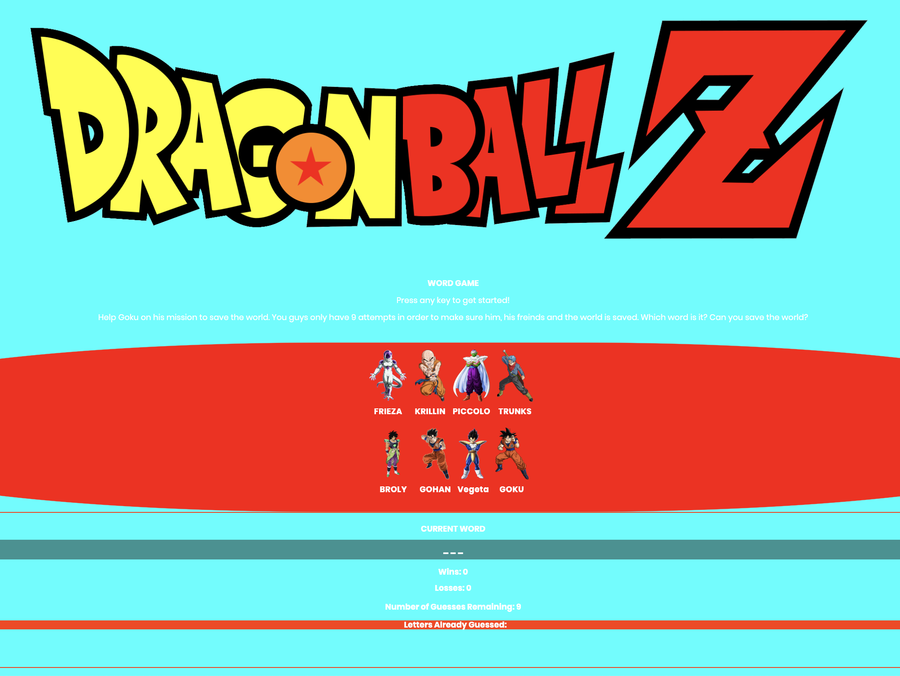

# Wordgame-JavaScript

## Challenges I Faced?

I had difficulty understanding how to put the underlying logic of a wordgame into JavaScript. More specifically being able to validate when the user how to match and keeping the card right side up. 

## How Did I Over Come Those Challenges? 

By collaborating with my peers I was able to get a better understanding of how I should approach this problem. I wrote out what I wanted to happen step-by-step on a whiteboard. Once I had a general idea of how the program should work I began to take the logic that I wrote out in common english and translated into JavaScript bit by bit. By leveraging platforms like Google, YouTube, MDN docs, Stackoverflow, GitHub, online courses,bootcamps and reference guides I was able to find the proper JavaScript methods and functions needed to complete the task and I programmed the Word Game accordingly.

## What Did I Learn? 

* How to implement HTML more efficiently
* How to manipulate CSS Layouts more efficiently
* Obtained a deeper understanding of Javascript Fundamentals
* Received a deeper understanding of jQuery Fundamentals

